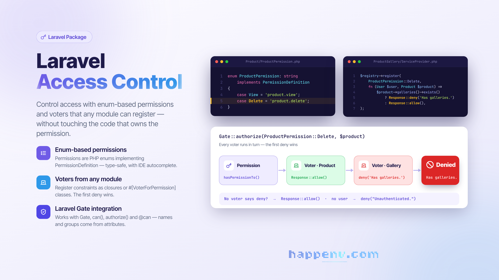
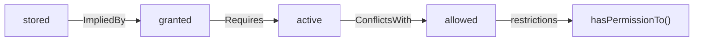

# Laravel Access Control

<div class="filament-hidden">



</div>

[](https://packagist.org/packages/happenv-com/laravel-access-control)
[](https://packagist.org/packages/happenv-com/laravel-access-control)

A modular access control library for Laravel applications that uses **enum-based permissions** and a **voter system**. Perfect for modular monolith architectures where different modules can define their own permission logic and extend existing.

### Example

Imagine two modules: **Product** and **ProductGallery**. The Product module knows nothing about ProductGallery, but ProductGallery should block product deletion until all galleries are removed.

**Product module** defines the permission:
```php
enum ProductPermission: string implements PermissionDefinition
{
    case Delete = 'product.delete';
}
```

**ProductGallery module** registers a voter to add its constraint:
```php
// In ProductGalleryServiceProvider
$registry = resolve(VoterRegistry::class);

$registry->register(
    ProductPermission::Delete,

    function (User $user, Product $product = null): Response {
        if ($product && $product->galleries()->exists()) {
            return Response::deny('Cannot delete product with galleries.');
        }
        return Response::allow();
    }
);
```

This library allows achieving such behavior without tightly coupling the two modules.

## Key Features

- 🔐 **Enum-based permissions** - Define permissions as PHP enums for type-safety and IDE autocomplete
- 🗳️ **Voter system** - Replace Laravel Policies with flexible voters that can be registered from any module
- 📦 **Modular architecture** - Each module can register its own voters without modifying core logic
- 🏷️ **Permission metadata** - Add names, descriptions, and groups to permissions via PHP attributes
- 🔗 **Rules between permissions** - Declare that a permission requires, comes with or conflicts with another — enforced in every check
- 🗺️ **Permission graphs** - Draw the catalogue, or what a user may do and why, as a tree, Mermaid, Graphviz or an array
- ⚡ **Laravel Gate integration** - Works seamlessly with Laravel's authorization system

## When to Use This Package

This package is designed primarily for **modular monolith architectures** where your application is split into independent modules (e.g., using [nWidart/laravel-modules](https://github.com/nWidart/laravel-modules) or [InterNACHI/modular](https://github.com/InterNACHI/modular)).

The key advantage of this package is that **voters can be registered from any module**, allowing each module to define its own authorization constraints without modifying the core application or other modules.

### When NOT to Use This Package

If you're building a traditional Laravel monolith without modular architecture, you probably don't need this package. In that case, the following solutions are sufficient:

- **[Laravel Policies](https://laravel.com/docs/authorization#creating-policies)** - Built-in authorization system, perfect for simple applications
- **[spatie/laravel-permission](https://github.com/spatie/laravel-permission)** - Excellent package for role and permission management in monolithic applications

## Requirements

- PHP 8.4+
- Laravel 12.0+

## Installation

You can install the package via composer:

```bash
composer require happenv-com/laravel-access-control
```

## Usage

### 1. Define Permissions as Enums

Create an enum that implements `PermissionDefinition`:

```php
<?php

namespace App\Permissions;

use Happenv\LaravelAccessControl\Contracts\PermissionDefinition;

enum ProductPermission: string implements PermissionDefinition
{
    case View = 'product.view';
    case Create = 'product.create';
    case Update = 'product.update';
    case Delete = 'product.delete';
}
```

> **Tip:** In modular applications, consider prefixing permission values with your module name (e.g., `pim-module.product.view`, `inventory-module.stock.update`) to avoid conflicts between modules and make it clear which module owns each permission.

### 2. Register Permissions

Register your permission enums in a service provider:

```php
<?php

namespace Modules\Category\Providers;

use Illuminate\Support\ServiceProvider;
use Happenv\LaravelAccessControl\PermissionRegistry;
use Modules\Category\Permissions\CategoryPermission;

class CategoryModuleServiceProvider extends ServiceProvider
{
    public function boot(): void
    {
        $registry = resolve(PermissionRegistry::class);
        
        $registry->register([
            CategoryPermission::class,
        ]);
    }
}
```

### 3. Register Voters

Voters allow you to add custom authorization logic to permissions. The main advantage is that **voters can be registered from any module**, making them perfect for modular monolith architectures.

#### Using Closures

```php
<?php

namespace Modules\Product\Providers;

use Illuminate\Auth\Access\Response;
use Illuminate\Support\ServiceProvider;
use Happenv\LaravelAccessControl\PermissionRegistry;
use Happenv\LaravelAccessControl\VoterRegistry;
use App\Models\User;
use Modules\Category\Models\Category;
use Modules\Category\Permissions\CategoryPermission;
use Modules\Product\Permissions\ProductPermission;

class ProductModuleServiceProvider extends ServiceProvider
{
    public function boot(): void {
        $registry = resolve(PermissionRegistry::class);
        
        $registry->register([
            ProductPermission::class,
        ]);

        $registry = resolve(VoterRegistry::class);

        $registry->register(
            CategoryPermission::Delete,

            function (User $user, Category $category = null): Response {
                if ($category->products()->exists()) {
                    return Response::deny(
                        'Cannot delete category with assigned products.'
                    );
                }

                return Response::allow();
            }
        );
    }
}
```

#### Using Voter Classes

For more complex logic, create dedicated voter classes with the `#[VoterForPermission]` attribute:

```php
<?php

namespace App\Voters;

use Illuminate\Auth\Access\Response;
use Happenv\LaravelAccessControl\Attributes\VoterForPermission;
use App\Models\User;
use App\Models\Currency;
use App\Models\Channel;
use App\Permissions\CurrencyPermission;

final class CurrencyVoter
{
    #[VoterForPermission(CurrencyPermission::Delete)]
    public function preventDeletingUsedByChannels(User $user, Currency|string|null $currency): Response
    {
        if (!$currency instanceof Currency) {
            return Response::allow();
        }
        
        if (Channel::query()->whereJsonContains('currencies', $currency->code)->exists()) {
            return Response::deny('Some channels are using this currency.');
        }

        return Response::allow();
    }

    #[VoterForPermission(CurrencyPermission::Update)]
    public function preventUpdatingDefaultCurrency(User $user, Currency|string|null $currency): Response
    {
        if ($currency instanceof Currency && $currency->is_default) {
            return Response::deny('Cannot modify the default currency.');
        }

        return Response::allow();
    }
}
```

Register the voter class:

```php
$registry = resolve(VoterRegistry::class);

$registry->register(CurrencyVoter::class);

// Or register multiple classes at once
$registry->register([
    CurrencyVoter::class,
    ProductVoter::class,
    ChannelVoter::class,
]);
```

### 4. Using Authorization

The package integrates with Laravel's Gate, so you can use standard authorization methods:

```php
// Using Gate
Gate::allows(ProductPermission::View, $product);
Gate::authorize(ProductPermission::Delete, $product);

// Using the User model
$user->can(ProductPermission::Update, $product);
$user->cannot(ProductPermission::Delete, $product);

// In controllers
$this->authorize(ProductPermission::Update, $product);

// In Blade templates
@can(ProductPermission::View, $product)
    <a href="{{ route('products.show', $product) }}">View</a>
@endcan
```

### 5. Adding Permission Metadata (Optional)

Enhance your permissions with names, descriptions, and groups using PHP attributes:

#### Permission Groups

First, create a permission group:

```php
<?php

namespace App\Permissions\Groups;

use Happenv\LaravelAccessControl\Contracts\PermissionGroupDefinition;

final class ProductGroup implements PermissionGroupDefinition
{
    public function getName(): string
    {
        return 'Products';
    }

    public function getDescription(): ?string
    {
        return 'Permissions related to product management';
    }

    public function getSlug(): string
    {
        return 'products';
    }
}
```

#### Enhanced Permission Enum

```php
<?php

namespace Modules\Product\Permissions;

use Happenv\LaravelAccessControl\Contracts\PermissionDefinition;
use Happenv\LaravelAccessControl\Attributes\PermissionGroup;
use Happenv\LaravelAccessControl\Attributes\PermissionName;
use Happenv\LaravelAccessControl\Attributes\PermissionDescription;
use Modules\Product\PermissionGroups\ProductGroup;

#[PermissionGroup(ProductGroup::class)]
enum ProductPermission: string implements PermissionDefinition
{
    #[PermissionName('View Products')]
    #[PermissionDescription('Allows viewing product details')]
    case View = 'product.view';

    #[PermissionName('Create Products')]
    #[PermissionDescription('Allows creating new products')]
    case Create = 'product.create';

    #[PermissionName('Update Products')]
    #[PermissionDescription('Allows modifying existing products')]
    case Update = 'product.update';

    #[PermissionName('Delete Products')]
    #[PermissionDescription('Allows removing products from the system')]
    case Delete = 'product.delete';
}
```

#### Subjects

A group says which module owns a permission. A **subject** says what the permission is
about, and there is exactly one per permission enum — the enum is already a stand-in for
the thing being guarded.

The level matters as soon as several enums share a group. Without it, that group renders
as one flat list in which `View` appears once per enum with nothing to tell the entries
apart. Nothing has to be declared to get it: the subject is named after the enum with the
`Permission` suffix dropped.

Label it explicitly by putting `PermissionName` and `PermissionDescription` on the enum
CLASS — the same attributes the cases use:

```php
#[PermissionGroup(SettingsGroup::class)]
#[PermissionName('Store Settings')]
#[PermissionDescription('Settings that apply to the whole store')]
enum StoreSettingPermission: string implements PermissionDefinition
{
    case View = 'store-setting.view';
    case Update = 'store-setting.update';
}
```

A permission that declares no name of its own is labelled from its subject
(`View Store Settings`), so annotating the class relabels every case under it at once.

#### Retrieving Permission Metadata

```php
use Happenv\LaravelAccessControl\PermissionCollection;

$collection = resolve(PermissionCollection::class);

// Groups, each with a flat `children` list AND a `subjects` map
$grouped = $collection->getGroupedPermissions();

foreach ($grouped as $group) {
    foreach ($group->subjects as $subject) {
        $subject->name;     // 'Store Settings'
        $subject->slug;     // 'store-setting'
        $subject->enum;     // StoreSettingPermission::class
        $subject->children; // PermissionDto[]
    }
}

// Flat list of all permissions
$permissions = $collection->getPermissions();

// Every subject across every group, keyed by its enum
$subjects = $collection->getSubjects();
```

This is useful for building permission management UIs.

### 6. Restricting Permissions at Runtime (Optional)

Sometimes a permission has to be withheld from **everybody** for a while, whatever they were
granted — a read-only mode, a maintenance window, a suspended organisation. A restriction does
that without touching anybody's grants: nothing is revoked, and when the condition ends everybody
holds exactly what they held before.

#### Declaring which permissions write data

Mark the permissions whose use writes data with `#[MutatesData]`. On the enum CLASS it is the
default for every case; a case carrying its own REPLACES that default, so `#[MutatesData(false)]`
opts a case out:

```php
use Happenv\LaravelAccessControl\Attributes\MutatesData;

#[PermissionGroup(ProductGroup::class)]
#[MutatesData]
enum ProductPermission: string implements PermissionDefinition
{
    #[MutatesData(false)]
    case View = 'product.view';

    case Create = 'product.create';
    case Update = 'product.update';
    case Delete = 'product.delete';
}
```

Read it back through the reflector:

```php
use Happenv\LaravelAccessControl\PermissionReflector;

$reflector = new PermissionReflector(ProductPermission::class);

$reflector->mutatesData(ProductPermission::Delete); // true  (the class default)
$reflector->mutatesData(ProductPermission::View);   // false (the case replaces it)
$reflector->declaresMutatesData();                  // true  (every case is answered by a declaration)
```

A permission that declares nothing reads as **not** writing. If every permission of your
application must be classified, assert `declaresMutatesData()` over your enums in a test — an enum
annotated case by case would otherwise let a new, unannotated case read as "does not write" without
anybody deciding so.

#### Registering a restriction

Register a closure in a service provider's `boot()`. It receives the permission being checked and
returns `true` to withhold it. Here, a read-only mode that withholds every permission that writes:

```php
use Happenv\LaravelAccessControl\Contracts\PermissionDefinition;
use Happenv\LaravelAccessControl\Facades\AccessControl;
use Happenv\LaravelAccessControl\PermissionReflector;

AccessControl::restrictUsing(
    fn (PermissionDefinition $permission): bool => ReadOnlyMode::isActive()
        && (new PermissionReflector($permission::class))->mutatesData($permission),
);
```

While the closure returns `true` for a permission:

- the Gate refuses it with **the same message as a missing permission** (`Unauthorized.`, or
  `Unauthorized for product.delete` with `display_permission_in_exception`) — to the caller it is
  the same problem, and the message is a contract consumers match on;
- `hasPermissionTo()` from `HasPermissions`, `HasRoles` and `HasRolesAndPermissions` returns
  `false` — `HasRoles` asks before its per-instance memo, so a restriction that begins mid-request
  is honoured;
- the stored grants are untouched: `givePermissionTo()` and `revokePermissionTo()` keep working.

Several closures may be registered; a permission is restricted when **any** of them says so.
`AccessControl::isRestricted($permission)` asks the same question directly.

A few things to keep in mind:

- **Register at boot, answer fresh.** The closures are called on every check and nothing is cached,
  which is what keeps restrictions correct under Laravel Octane. Keep them cheap, and read the
  condition from its source or from something request-scoped — never from a value captured at boot.
- **A model with its own `hasPermissionTo()`** (an administrator short-circuit, say) is still
  refused by the Gate, but its own method answers whatever it answers. Ask
  `AccessControl::isRestricted()` there if that method is called outside the Gate.
- **Ability strings are not restricted.** Restrictions are keyed by permission enum;
  `HasRoles::hasPermissionTo('product.delete')` is answered by the roles alone.
- **A `Gate::before()` callback that returns `true` bypasses restrictions.** That is the usual
  super-admin pattern, and Laravel skips the ability's closure — where the restriction is checked —
  whenever a `before` callback returns a non-null result. Ask `AccessControl::isRestricted()` inside
  such a callback, or let it return `null` for restricted permissions.
- **On a grant container, `hasPermissionTo()` now means "may act", not "is stored".** A `Role`
  using `HasPermissions` answers `false` for a restricted permission it holds. A role editor that
  pre-fills its checkboxes from `hasPermissionTo()` shows the restricted grants unchecked, and saving
  the form during a restriction revokes them. Read the stored grants (`getPermissions()`) wherever
  you edit or display what was granted.
  Rules widen the gap: a permission can be effective without being stored (implied) and stored without being effective (a requirement missing).

### 7. Rules Between Permissions (Optional)

A permission can declare how it relates to another permission. The package applies these rules
itself — in `hasPermissionTo()`, and therefore in the Gate — and describes them to a
permission-management UI.

| Attribute on X | Meaning |
|---|---|
| `#[Requires(A)]` | X is effective only while A is effective. |
| `#[ImpliedBy(A)]` | Whoever is granted A is granted X as well. |
| `#[ConflictsWith(A)]` | X is not effective while A is effective. |

```php
use Happenv\LaravelAccessControl\Attributes\ConflictsWith;
use Happenv\LaravelAccessControl\Attributes\ImpliedBy;
use Happenv\LaravelAccessControl\Attributes\PermissionGroup;
use Happenv\LaravelAccessControl\Attributes\Requires;

#[PermissionGroup(GalleryGroup::class)]
enum GalleryPermission: string implements PermissionDefinition
{
    #[Requires(ProductPermission::View)]
    case View = 'gallery.view';

    #[ImpliedBy(ProductPermission::Update, reason: 'permissions.rules.follows')]
    case Manage = 'gallery.manage';
}

#[PermissionGroup(OrderGroup::class)]
enum OrderPermission: string implements PermissionDefinition
{
    #[ConflictsWith(self::ViewAny)]
    case ViewOwn = 'order.view-own';

    case ViewAny = 'order.view-any';
}
```

Each attribute is repeatable. Several `Requires` on one case mean all of them are needed.

**A rule changes only the permission that declares it.**
- `Requires` and `ConflictsWith` narrow it, and `ImpliedBy` widens it. Nothing a module declares
  changes the answer for another module's permission.
- Declare a rule in the module that knows the other one. That is why both directions of an
  implication exist: `Requires` points at what X needs, and `ImpliedBy` at what brings X along.
- A permission that declares no rule is answered exactly as before.

How a permission is resolved for a principal:



- **stored**: in the principal's grants, directly or through any role.
- **granted**: stored, or stored by anything that implies it, transitively. A cycle of implications
  means that its permissions come together.
- **active**: granted, and every permission it requires is active.
- **allowed**: active, and no permission it conflicts with is active.

Worth knowing:

- **Nothing is written.**
  - `givePermissionTo(ProductPermission::Update)` stores `product.update` alone. An implied permission
    is never stored, so revoking `Update` takes what it implied with it.
  - Revoking a permission that something still implies changes nothing.
- **An implication follows the grant.** X implied by A is granted whenever A is granted, even if A
  itself is inactive because a requirement is missing. That is what lets `Update #[Requires(View)]`
  next to `View #[ImpliedBy(Update)]` work.
- **Only the declaring side of a conflict loses.** With both `ViewOwn` and `ViewAny`, `ViewOwn` is
  denied and `ViewAny` keeps working. Declare the conflict on both cases to deny both.
- **Restrictions come last.** A restriction on `Update` withholds `Update`, not what `Update` implies.
- **The voters of the permission being checked run.** `Gate::allows(GalleryPermission::Manage)` runs
  the voters of `Manage`, never those of the permission that implies it.
- **`hasPermissionTo()` with an ability string is not ruled.** Like restrictions, rules are keyed by
  permission enum, so `$user->hasPermissionTo('gallery.manage')` is answered without them. The Gate
  is different: `Gate::allows('gallery.manage')` reaches the ability defined for the
  enum case, and is ruled.
- **A model with its own `hasPermissionTo()` bypasses the rules**, as it bypasses restrictions. It
  can ask `resolve(PermissionResolver::class)->allows($permission, $isStored)` itself.

#### Rules across roles: `HoldsGrants`

Rules are resolved over the union of a principal's grants. A requirement one role stores satisfies a
permission another role stores, and a conflict between two roles is seen. For that, a role has to
hand over its raw grants: declare `HoldsGrants` on it. `HasPermissions` already provides the method.

```php
use Happenv\LaravelAccessControl\Contracts\HoldsGrants;

class Role extends Model implements AuthControllable, HoldsGrants
{
    use HasPermissions;

    // ...
}
```

A role that declares `HoldsGrants` is **no longer asked `hasPermissionTo()`**: its stored grants are
read as they are. If your role class overrides `hasPermissionTo()` — a super-admin role, a role that
can be switched off — keep it off `HoldsGrants`, or put that logic into `getGrants()`. Otherwise the
override stops applying, and a role that is switched off would grant again.

A role without `HoldsGrants` is asked `hasPermissionTo()` as before. It answers whether it may *act*,
with its own rules and any restriction already applied, and that answer stands in for what it stores:
- A requirement stored in another role does not count.
- A related permission that is restricted, or that loses a conflict within that role, counts as
  absent. A resolution that read a restricted permission this way is never remembered, so it
  does not outlive the restriction.
- Implications and conflicts between such roles still work.

`HoldsGrants` also makes checks faster: a principal reads its roles' grants once, instead of scanning
every role for every permission. Call `forgetResolvedPermissions()` after a principal's roles, or the
grants of one of its roles, change within the same request.

#### Checking your declarations

Two mistakes throw `InvalidPermissionRuleException` at the first permission check:
- a rule about the permission itself;
- a cycle of `Requires`.

Declarations that compile but cannot mean what they say are listed by `PermissionGraph::problems()`.
Assert it in a test:

```php
use Happenv\LaravelAccessControl\PermissionGraph;

it('declares sound permission rules', function (): void {
    expect(resolve(PermissionGraph::class)->problems())->toBe([]);
});
```

`problems()` reports:
- a permission that can never be allowed, because it conflicts with something it requires or implies;
- a rule pointing at a permission whose enum is not registered.

It never reports a permission that can be allowed.

#### Rules in a permission-management UI

Every `PermissionDto` from `PermissionCollection` carries `rules`: each rule it declares **or** is the
target of. The same `PermissionRuleDto` sits on both ends.

```php
foreach ($permission->rules as $rule) {
    $rule->type;        // PermissionRuleType::Requires, ImpliedBy or ConflictsWith
    $rule->permission;  // the permission that declares it
    $rule->other;       // the permission it points at
    $rule->reason;      // translated, or null
}
```

A `reason` is a translation key or plain text. It is passed through `__()` with `:permission` and
`:other` (the two names), in the locale of the request that reads it. On PHP 8.5+, where an attribute
argument may be a static closure, it can also be a `Closure(string $permission, string $other): string`.

To show why a permission is or is not effective, ask the resolver with a closure that says what is
stored. The closure can describe the unsaved state of a form:

```php
use Happenv\LaravelAccessControl\PermissionResolver;

$resolution = resolve(PermissionResolver::class)->explain(
    GalleryPermission::Manage,
    fn (PermissionDefinition $permission): bool => in_array($permission->value, $checked, true),
);

$resolution->allowed;     // effective by the rules (restrictions are not included)
$resolution->stored;      // ticked
$resolution->granted;     // ticked, or implied
$resolution->grantedBy;   // the permissions that imply it and are granted
$resolution->missing;     // its requirements that are not active
$resolution->conflicting; // the permissions it conflicts with that are active
```

A role editor should still read and save the **stored** grants. See the note on grant containers in
the previous section.

### 8. Drawing Permission Graphs (Optional)

Draw the rules of the whole catalogue, or what one principal may do and why.

#### In the terminal

```bash
php artisan permission:graph                      # the whole catalogue
php artisan permission:graph 42                   # the user with key 42
php artisan permission:graph 42 --format=mermaid  # paste straight into a document
php artisan permission:graph 42 --format=dot      # pipe into Graphviz: | dot -Tsvg > user.svg
php artisan permission:graph 42 --format=json     # a machine contract, versioned by its schema
```

The principal is loaded with the user provider model of the default guard. Pick another guard with
`--guard=admin`, or name the model with `--model="App\Models\Admin"`. It has to implement
`AuthControllable`.

For example, suppose `gallery.view` requires `product.view`, `gallery.manage` is implied by
`product.update`, and both enums sit in one `Products` group. A user who stores `product.update`
directly and holds an `Editor` role (a `HoldsGrants` role storing `gallery.view`) is drawn as:

```
Jan
├── direct grants
│   └── Update Products (product.update) [allowed]
│       └── implies Manage Gallery
└── Editor
    └── View Gallery (gallery.view) [missing requirement]
        └── requires View Products
not stored
└── Products
    ├── Product
    │   └── View Products (product.view) [not granted]
    └── Gallery
        └── Manage Gallery (gallery.manage) [implied]
            └── implied by Update Products
```

A principal's graph shows the roles it holds (`getRoles()`) and its direct grants (`HasPermissions`).
It also shows what each of them stores, and every permission that concerns the principal, marked with
its state:

| State | Meaning |
|---|---|
| `allowed` | effective and stored |
| `implied` | effective without being stored — something the principal holds implies it |
| `overridden` | effective because the principal's own `hasPermissionTo()` says so, though nothing stores or implies it — an administrator short-circuit |
| `restricted` | the rules allow it; a runtime restriction withholds it |
| `missing-requirement` | granted (stored or implied), but a permission it requires is not active |
| `conflict` | it loses a conflict it declares |
| `denied` | the principal's own `hasPermissionTo()` refuses it for another reason |
| `not-granted` | drawn only because a rule points at it |

The tree prints the states with spaces (`missing requirement`). `toArray()` and the JSON output carry
them as listed.

A role that implements `HoldsGrants` shows what it stores. Any other role is asked about each
permission, and its edges read "may act". Such a role can only say whether it may act, with its own
rules and any restriction already applied, so **what it withholds is not drawn at all**. In a
read-only mode, for example, its restricted permissions disappear instead of showing as `restricted`.
Implement `HoldsGrants` on your roles to get a diagram that shows everything.

#### In your application

```php
use Happenv\LaravelAccessControl\Facades\AccessControl;

$diagram = AccessControl::diagram()->forPrincipal($user);   // or ->catalogue()

AccessControl::diagram()->render($diagram, 'mermaid');      // or 'dot', 'tree', 'json'
$diagram->toArray();                                        // nodes, edges and clusters, to draw yourself
```

Render the Mermaid text with [mermaid.js](https://mermaid.js.org) on a page:

```blade
<pre class="mermaid">{{ AccessControl::diagram()->render($diagram, 'mermaid') }}</pre>
<script type="module">
    import mermaid from 'https://cdn.jsdelivr.net/npm/mermaid@11/dist/mermaid.esm.min.mjs';
    mermaid.initialize({ startOnLoad: true });
</script>
```

`toArray()` returns:
- `schema` (`access-control.permission-diagram`, version 1);
- `kind`;
- `clusters` (`id`, `label`, `parent`);
- `nodes` (`id`, `kind`, `label`, `permission`, `state`, `cluster`);
- `edges` (`from`, `to`, `kind`, `label`).

That is enough for cytoscape, d3 or a list of your own.

#### Naming principals and roles

A node is labelled with:
1. `getGrantHolderName()`, when the class implements `DescribesGrantHolder`;
2. otherwise an Eloquent `name` attribute;
3. otherwise the class name and key (`Role#3`).

```php
use Happenv\LaravelAccessControl\Contracts\DescribesGrantHolder;

class Role extends Model implements AuthControllable, HoldsGrants, DescribesGrantHolder
{
    public function getGrantHolderName(): string
    {
        return $this->title;
    }
}
```

#### Your own format

Implement `DiagramRenderer` and tag it. A renderer of an existing format replaces the package's own:

```php
use Happenv\LaravelAccessControl\Diagram\Renderer\DiagramRendererRegistry;

$this->app->tag([PlantUmlRenderer::class], DiagramRendererRegistry::TAG);
```

It is then available to `render()` and to `permission:graph --format=`.

## How Voters Work

1. When a permission check is performed via Laravel's Gate, the package first refuses a permission withheld by a [runtime restriction](#6-restricting-permissions-at-runtime-optional), then verifies if the user has the permission (via `$user->hasPermissionTo()`, which applies the [rules between permissions](#7-rules-between-permissions-optional))
2. If the user has the permission, all registered voters for that permission are executed
3. **If any voter returns `Response::deny()`, the authorization fails**
4. Only if all voters return `Response::allow()`, the authorization succeeds

This allows different modules to add constraints to permissions without knowing about each other.

## Voters vs Policies

| Feature | Laravel Policies | Voters |
|---------|-----------------|--------|
| Location | Single class per model | Can be anywhere |
| Modularity | Coupled to model | Fully decoupled |
| Multiple handlers | No | Yes |
| Cross-module logic | Difficult | Easy |
| Registration | Automatic by convention | Explicit |

## Model Setup

The model on which authorization checks are performed (typically `User`) must implement the `AuthControllable` interface.

This package provides three traits for managing permissions:

### HasRoles (Recommended)

Use this trait when users receive permissions **only through roles**. This is the recommended approach for most applications.

```php
<?php

namespace App\Models;

use Illuminate\Foundation\Auth\User as Authenticatable;
use Happenv\LaravelAccessControl\Contracts\AuthControllable;
use Happenv\LaravelAccessControl\Traits\HasRoles;

class User extends Authenticatable implements AuthControllable
{
    use HasRoles;

    /**
     * Get roles assigned to the user.
     */
    public function getRoles(): iterable
    {
        return $this->roles; // Your roles relationship
    }
}
```

### HasPermissions

Use this trait for models that store permissions directly (e.g., a `Role` model). This trait provides `givePermissionTo()` and `revokePermissionTo()` methods.

```php
<?php

namespace App\Models;

use Illuminate\Database\Eloquent\Model;
use Illuminate\Support\Collection;
use Happenv\LaravelAccessControl\Contracts\AuthControllable;
use Happenv\LaravelAccessControl\Contracts\HoldsGrants;
use Happenv\LaravelAccessControl\Traits\HasPermissions;

class Role extends Model implements AuthControllable, HoldsGrants
{
    use HasPermissions;

    protected $casts = [
        'permissions' => 'array',
    ];

    protected function getPermissions(): Collection
    {
        return new Collection($this->permissions ?? []);
    }

    protected function setPermissions(Collection $permissions): void
    {
        $this->permissions = $permissions->toArray();
        $this->save();
    }
}
```

Declaring `HoldsGrants` lets a principal resolve [rules between permissions](#rules-across-roles-holdsgrants) across all of its roles.

> You can also use this trait directly on User.

### HasRolesAndPermissions

Use this trait when users can receive permissions **both through roles AND directly**. Permissions are checked in both sources.

```php
<?php

namespace App\Models;

use Illuminate\Foundation\Auth\User as Authenticatable;
use Illuminate\Support\Collection;
use Happenv\LaravelAccessControl\Contracts\AuthControllable;
use Happenv\LaravelAccessControl\Traits\HasRolesAndPermissions;

class User extends Authenticatable implements AuthControllable
{
    use HasRolesAndPermissions;

    protected $casts = [
        'permissions' => 'array',
    ];

    public function getRoles(): iterable
    {
        return $this->roles;
    }

    protected function getPermissions(): Collection
    {
        return new Collection($this->permissions ?? []);
    }

    protected function setPermissions(Collection $permissions): void
    {
        $this->permissions = $permissions->toArray();
        $this->save();
    }
}
```

## Testing

```bash
composer test
```

## License

The MIT License (MIT). Please see [License File](LICENSE.md) for more information.
